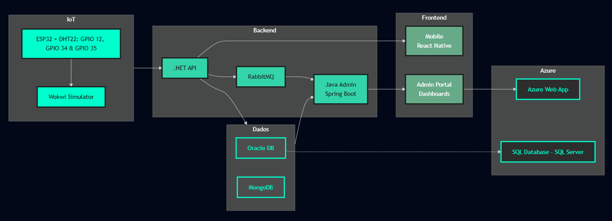

# WaterWise - Sistema Inteligente de Prevenção a Enchentes

A **WaterWise** é um ecossistema tecnológico integrado que previne enchentes urbanas através do monitoramento inteligente de propriedades rurais, baseado em Mairiporã-SP - município estrategicamente escolhido por sua localização na Serra da Cantareira e por enfrentar desafios típicos da transição entre áreas rurais e urbanas da Grande São Paulo. 

Mairiporã apresenta características ideais para este projeto: possui extensas áreas rurais com propriedades agrícolas que impactam diretamente no ciclo hidrológico regional, está inserida em uma bacia hidrográfica importante para o abastecimento metropolitano, e enfrenta pressões de urbanização que tornam crítico o monitoramento da capacidade de retenção hídrica do solo. 

O município serve como modelo representativo para outras cidades da região metropolitana que vivenciam a mesma dinâmica de expansão urbana sobre áreas rurais, onde o controle da impermeabilização do solo e o monitoramento das propriedades rurais são fundamentais para a prevenção de enchentes urbanas a jusante, ou seja, se Mairiporã está na Serra da Cantareira (parte alta), as águas que saem de lá descem em direção às áreas mais baixas da Grande São Paulo. Então, o que acontece em Mairiporã (montante) afeta diretamente as cidades que estão na direção do fluxo das águas (jusante), como algumas regiões da zona norte de São Paulo.

*"A enchente que alaga uma avenida pode começar com uma gota que o solo seco da zona rural não absorveu. Com WaterWise, cada metro de terra volta a ser uma esponja contra desastres."*

## 🏗Arquitetura de Solução End-to-End

## Repositórios por Disciplina

### Backend & APIs
- **[.NET API](https://github.com/WaterWise-GlobalSolution/waterwise-api-dotnet)** - API principal com ML.NET e RabbitMQ Producer
- **[Java Admin](https://github.com/WaterWise-GlobalSolution/waterwise-java-spring-mvc)** - Portal administrativo Spring Boot MVC e RabbitMQ Consumer

### Frontend & Mobile  
- **[Mobile App](https://github.com/WaterWise-GlobalSolution/waterwise-mobile-react)** - App Mobile com React Native

### IoT & Hardware
- **[IoT Sensors](https://github.com/WaterWise-GlobalSolution/waterwise-iot_ia)** - ESP32 + sensores
- **[IoT Sensors](https://github.com/WaterWise-GlobalSolution/waterwise_conexao_iot_db)** - Simulator + Python API + Persistência Oracle DB + Dashboards

### 🗄Data & Infrastructure
- **[Database](https://github.com/WaterWise-GlobalSolution/waterwise-database)** - Oracle DB + MongoDB
- **[Cloud Deploy](https://github.com/WaterWise-GlobalSolution/waterwise-devops)** - Azure WebApp + Azure SQL Database

## Pitch
- **Pitch Video**: [YouTube](...)

## Desenvolvedores
- Felipe Matos - RM553528 - 2TDSPS
- Leonardo de Oliveira - RM554024 - 2TDSPS
- Sara Sousa - RM552656 - 2TDSPS
